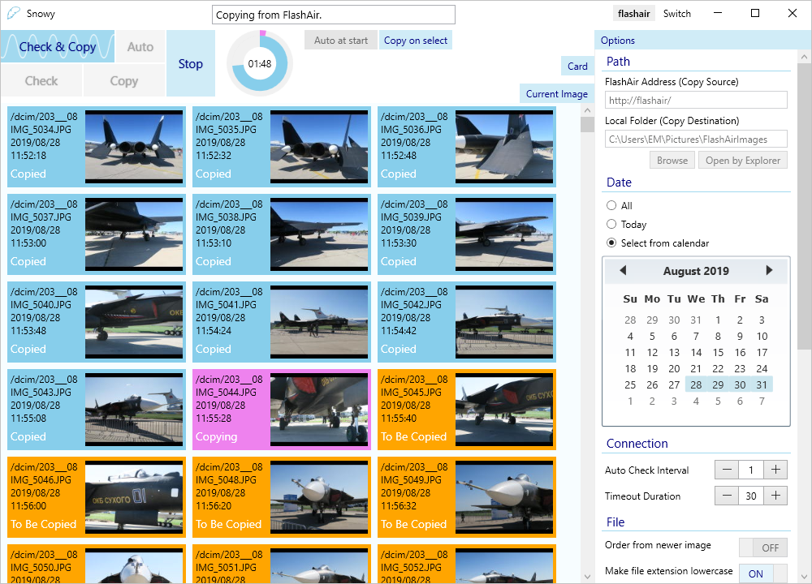
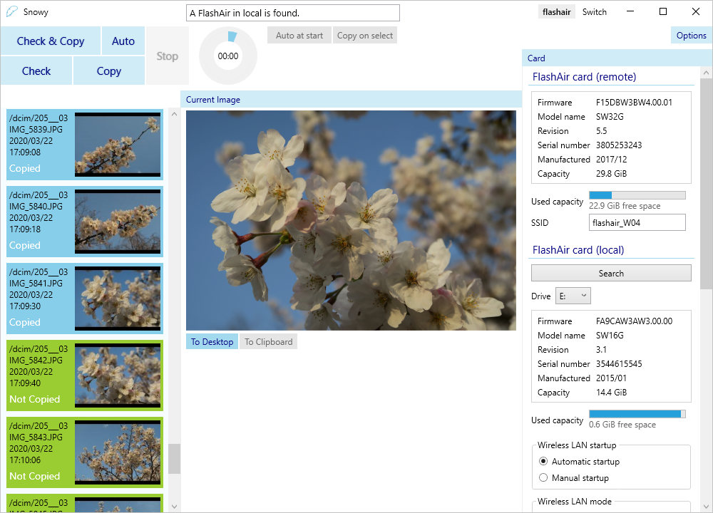

# Snowy

Snowy is a Windows desktop app to copy images from FlashAir by a wireless connection. You can copy images in bulk or select from thumbnails one by one. Also you can make this app check new images automatically at a regular interval.

:book: [English](https://emoacht.github.io/SnowyImageCopy/readme_en.html) | :book: [Japanese](https://emoacht.github.io/SnowyImageCopy/readme_jp.html)
-|-

## Requirements

 - Windows 10 or newer
 - .NET 6.0 or .NET Framework 4.8

Tested on Windows 10 with SD-WB008G, SD-WC016G (W-02), SD-WE016G (W-03) and SD-UWA032G (W-04).

## Download

### Microsoft Store version

[Snowy Image Copy](https://www.microsoft.com/store/apps/9MTLPNGRW85L) 

### Standard version

:floppy_disk: <a href="https://github.com/emoacht/SnowyImageCopy/releases/latest">Latest release</a>

## Development

This app is a WPF app developed in C#.

As for FlashAir's API used in this app, refer to [FlashAir Developers](https://www.flashair-developers.com/)
 ([copy](https://flashair-developers.github.io/website/)).

## History

:scroll: [History](HISTORY.md)

## License

 - MIT License

## Libraries

 - [Reactive Extensions](https://github.com/dotnet/reactive)
 - [XamlBehaviors for WPF](https://github.com/microsoft/XamlBehaviorsWpf)
 - [Windows Community Toolkit](https://github.com/CommunityToolkit/WindowsCommunityToolkit)
 - [WPF Monitor Aware Window](https://github.com/emoacht/WpfMonitorAware)

## Developer

 - emoacht (emotom[atmark]pobox.com)

